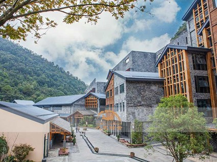
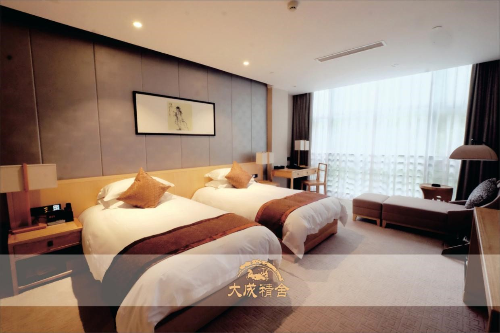

The 4th Spin Summit workshop is set to take place in **Guiyang, Guizhou Province, China**, from **August 4 to August 9, 2025**. 

**Plan your trip to Guiyang, China.**

# Venue

The workshop will be held in **Dacheng Jinshe Hotel, Guiyang (贵阳市十里河滩.孔学堂大成精舍酒店)**, where the participants will stay. We will reserve rooms in advance for all confirmed participants in this hotel.

<!--  -->

### Address

Shili Hetan, Confucius Academy, Huaxi District, Guiyang, Guizhou Province, China [(Google maps)](https://maps.app.goo.gl/3pvcHKPwgRqdGVD37)  
中国·贵州省·贵阳市·十里河滩孔学堂 [(高德地图)](https://surl.amap.com/2H4MBvE14dxC)

### Accommodation fee

|                   **Room**                  |                       **Price**                       |
|:-------------------------------------------:|:-----------------------------------------------------:|
|       Lyushe Twin Room (2 single beds)      | &nbsp;&nbsp;&nbsp; 450 CNY / night &nbsp;&nbsp;&nbsp; |
| Shangshe Double Bed Room (1 queen size bed) | &nbsp;&nbsp;&nbsp; 480 CNY / night &nbsp;&nbsp;&nbsp; |
|      Shangshe Twin Room (2 single beds)     | &nbsp;&nbsp;&nbsp; 550 CNY / night &nbsp;&nbsp;&nbsp; |

The price includes 2 breakfasts.

# Transport

### Getting to Guiyang

**By air**

- Guiyang Longdongbao International Airport (KWE/ZUGY) - 22 kilometers from the venue

**By train**

- Guiyang Station - 14 kilometers from the venue  
- Guiyang North Station - 22 kilometers from the venue

### Getting around Guiyang

**By underground**
- Nearest metro station: Confucius Academy Station (Line 3) - 1.7 kilometers from the venue

# Weather

During the conference, Guiyang is expected to be a bit hot, with average high and low temperatures of 29°C and 20°C, respectively. Rain is likely. To stay comfortable in the warm and humid weather, lightweight, breathable clothing is recommended.

# Travel information

- 孔学堂，Confucius Academy
- 天河潭景区，Tianhe Lake
- 黄果树瀑布，Huangguoshu Waterfall
